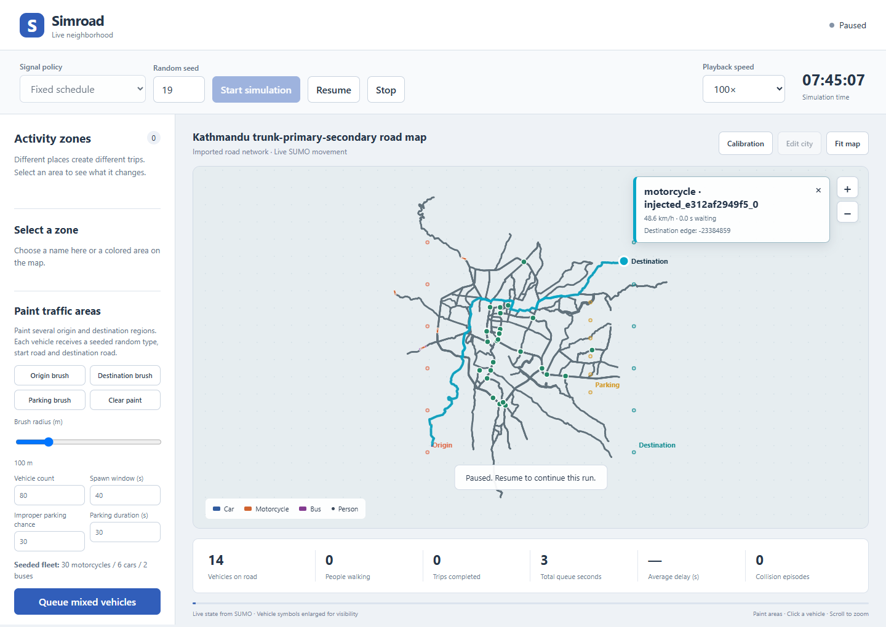

# Simroad

<p align="center">
  <strong>Create editable cities or explore Kathmandu traffic with Eclipse SUMO.</strong>
</p>

<p align="center">
  <a href="https://github.com/iamgroot400/simroad/actions/workflows/test.yml"></a>
  <a href="https://github.com/iamgroot400/simroad/releases/latest"></a>
  
  
</p>


Simroad is a local-first toolkit for exploring how roads, traffic signals,
vehicles, pedestrians, and activity zones interact. It is distributed in two
desktop editions: **Simroad Studio** for building a city yourself and **Simroad
Kathmandu** for experimenting on an embedded Kathmandu Valley road network. Both
editions include the visual editor, painted traffic areas, repeatable experiments,
calibration tools, and HTML/JSON/CSV reporting.

> [!IMPORTANT]
> Simroad is an experimental research toolkit. Results are not predictions of
> real traffic until the model has been calibrated and validated with suitable
> field observations.

## Highlights

- Import real roads from OpenStreetMap or build a synthetic network.
- Draw and edit roads, intersections, crossings, and activity zones visually.
- Simulate cars, motorcycles, buses, and pedestrians with Eclipse SUMO.
- Compare fixed, queue-responsive, Adaptive Webster, and Green Wave signals.
- Paint multiple origin and destination areas, then add a seeded mix of motorcycles,
  cars, and buses across all of them.
- Paint roadside obstructions to study how improper parking creates queues.
- Fit demand and behavior parameters against observed traffic counts.
- Generate reproducible HTML, JSON, and CSV results with queue and delay metrics.
- Run locally without an account, cloud service, React, or Node.js.
- Choose an editable Studio edition or an embedded Kathmandu edition.

## Download

Portable release builds run entirely on your computer. Each download includes
Python, SUMO, the browser interface, and its starting road network.

### Simroad Studio

Starts with the editable demonstration city. Draw and modify roads, intersections,
zebra crossings, signals, and colored zones, then paint origin, destination, and
improper-parking areas.

| Platform | Download | Launch |
| --- | --- | --- |
| Windows x64 | [Simroad-Studio-windows-X64.zip](https://github.com/iamgroot400/simroad/releases/latest/download/Simroad-Studio-windows-X64.zip) | Extract, then double-click `Simroad-Studio.exe` |
| macOS Apple Silicon | [Simroad-Studio-macos-ARM64.tar.gz](https://github.com/iamgroot400/simroad/releases/latest/download/Simroad-Studio-macos-ARM64.tar.gz) | Extract, then run `./Simroad-Studio` |
| Linux x64 | [Simroad-Studio-linux-X64.tar.gz](https://github.com/iamgroot400/simroad/releases/latest/download/Simroad-Studio-linux-X64.tar.gz) | Extract, then run `./Simroad-Studio` |

### Simroad Kathmandu

Starts with the embedded Kathmandu Valley `trunk`, `primary`, and `secondary`
road network. Choose any painted origin, destination, and parking areas without
having to import or build the base map first.

| Platform | Download | Launch |
| --- | --- | --- |
| Windows x64 | [Simroad-Kathmandu-windows-X64.zip](https://github.com/iamgroot400/simroad/releases/latest/download/Simroad-Kathmandu-windows-X64.zip) | Extract, then double-click `Simroad-Kathmandu.exe` |
| macOS Apple Silicon | [Simroad-Kathmandu-macos-ARM64.tar.gz](https://github.com/iamgroot400/simroad/releases/latest/download/Simroad-Kathmandu-macos-ARM64.tar.gz) | Extract, then run `./Simroad-Kathmandu` |
| Linux x64 | [Simroad-Kathmandu-linux-X64.tar.gz](https://github.com/iamgroot400/simroad/releases/latest/download/Simroad-Kathmandu-linux-X64.tar.gz) | Extract, then run `./Simroad-Kathmandu` |

[View all releases](https://github.com/iamgroot400/simroad/releases)

The interface opens in your default browser at `127.0.0.1`. It is available only
on the computer running Simroad and is not published to the internet or local
network. Keep the launcher terminal open and press **Ctrl+C** to stop the app.

Unsigned community builds can trigger Windows SmartScreen or macOS Gatekeeper.
Only use packages downloaded from this repository. Phones and tablets cannot run
the bundled SUMO engine.

## Quick start from source

Requirements:

- Python 3.11 or newer; Python 3.12 is recommended
- Internet access during first-time dependency installation

Clone the repository and launch the live viewer:

```bash
git clone https://github.com/iamgroot400/simroad.git
cd simroad
```

Windows:

```powershell
.\run_live.bat
```

macOS or Linux:

```bash
bash run_live.sh
```

The launcher creates or reuses a project-local virtual environment, installs the
required packages, builds the editable Studio network, and opens the application.
Generated files are written under `runs/` and are never silently overwritten.

## Kathmandu major-road map

The included Kathmandu project uses OpenStreetMap geometry for the Ring Road and
city core. It keeps `trunk`, `primary`, and `secondary` roads together with their
connector links, and configures left-hand traffic for Nepal.

```powershell
.\run_live.bat --project examples/kathmandu_major_roads/project.yaml
```

The source extract is included, so the network can be rebuilt offline. The sample
is geometry-first and deliberately avoids invented traffic counts. Add surveyed
zones, origin/destination demand, and calibration observations before using its
outputs for real-world decisions.

To make a first Kathmandu experiment, open the project with the command above,
paint several **Origin** areas on residential or gateway roads and several
**Destination** areas near offices, markets, or the city core. Paint **Parking**
only where you want stopped vehicles to obstruct a lane. Choose a seed, queue the
vehicles, and start the run. Reusing the same seed and painted areas reproduces
the same randomized vehicle choices and departure pattern.

## Visual city builder


Open **Edit city** in the live viewer to:

1. Start from the current network or create an empty layout.
2. Draw roads and connected intersections.
3. Configure lane count, speed, direction, and traffic signals.
4. Add zebra or signal-controlled crossings.
5. Add school, office, market, residential, hospital, or transit zones.
6. Build the SUMO network and immediately run the selected scenario.

Layouts can be saved locally and loaded again later. Imported real-world networks
remain viewable even when they are too complex to convert back into the simplified
editor model.

## How it works


1. **Build the network** — use the offline grid, import OpenStreetMap, supply an
   existing SUMO network, or draw a new layout.
2. **Describe demand** — define activity zones, time-varying trip patterns,
   gateway flows, fleet composition, and scheduled transit.
3. **Run SUMO** — Simroad generates deterministic demand, starts an isolated SUMO
   process, applies the selected control strategy, and records measurements.
4. **Compare experiments** — matching demand and seeds are used for paired policy
   comparisons with confidence intervals.
5. **Validate assumptions** — calibration evidence, configuration fingerprints,
   and model limitations are carried into the reports.

## Live viewer

The live interface displays actual vehicle and pedestrian positions from SUMO,
not a pre-rendered animation.



- Start, pause, resume, stop, and repeat a run.
- Select fixed, queue-responsive, Adaptive Webster, or Green Wave control.
- Paint one or more coral origin areas and teal destination areas with an
  adjustable brush. Each inserted vehicle independently receives a seeded random
  valid origin and destination from those areas.
- Use the default Kathmandu-oriented vehicle weights of 30 motorcycles, 6 cars,
  and 2 buses. These are random weights, so a small batch will usually not contain
  the exact ratio.
- Paint amber parking areas and set a probability and duration. Selected vehicles
  stop in-lane on routes that cross the painted area, representing improper
  parking and its downstream queues.
- Click a moving vehicle to reveal its private destination edge and draw its route.
  Destinations and routes remain hidden for unselected vehicles.
- Change playback speed without changing simulated time steps.
- Pan and zoom with mouse, keyboard, or touch controls.
- Inspect zones, live counts, collision episodes, and completed trips.
- Open the full report or download `report.json` and `metrics.csv` after a run
  finishes or is stopped.

### Painted traffic workflow

1. Select **Origin brush** and paint across every area that may generate traffic.
2. Select **Destination brush** and paint across every destination area.
3. Optionally select **Parking brush** and mark roads where illegal stopping may
   occur.
4. Set the vehicle count, departure window, parking probability, duration, and
   random seed.
5. Choose **Queue mixed vehicles**, then start the simulation.
6. Click individual vehicles to inspect their destination. Stop the run to export
   the final metrics.

The brush selects compatible SUMO edges inside its radius. When several origins
and destinations are painted, traffic is distributed across them rather than
entering from one point.

### Signal policies

| Policy | Behaviour |
| --- | --- |
| Fixed timing | Runs the signal program exactly as configured. |
| Queue responsive | Extends or shortens service from observed approach queues. |
| Adaptive Webster | Recalculates bounded green time from live flow and occupancy. |
| Green Wave | Offsets coordinated signals for progression near 40 km/h along the network's main axis. |

### High-volume runs

The car-count field has no artificial maximum. Simroad queues additions in
CPU-sized batches and limits the live canvas to a representative 5,000 vehicle
symbols while all vehicles remain in the simulation
and metrics. Large counts should be spread across enough simulated time and road
capacity to let SUMO insert them.

A 12 GB, 13th-generation Core i5 laptop can process a 100,000-trip experiment,
but should not be expected to hold 100,000 detailed vehicles moving at the same
instant in real time. Actual capacity depends on network size and congestion.
SUMO's microscopic traffic dynamics run on the CPU. Rewriting its vehicle solver
for GPU threads is technically possible as a research project, but it is not a
practical Simroad optimization: the interactions are branch-heavy and each step
depends on neighboring vehicles, while a rewrite would require extensive
validation against SUMO. The supported path is to use SUMO's CPU `--threads`
option where applicable, run independent seeds in parallel, and use `libsumo`
instead of socket-based TraCI when profiling shows protocol overhead. The GPU can
still accelerate browser canvas rendering.


## Command-line usage

After activating a Python environment and installing the project with
`python -m pip install -e ".[dev]"`:

```bash
# Validate configuration
simroad validate

# Build the configured SUMO network
simroad build --output runs/network

# Run one seeded experiment
simroad run --network runs/network/network.net.xml --output runs/first-run --seed 1

# Start the local-only browser viewer
simroad serve --network runs/network/network.net.xml

# Compare two signal policies using paired seeds
simroad compare \
  --network runs/network/network.net.xml \
  --output runs/policies \
  --strategies fixed pressure \
  --seeds 1 2 3 4 5 \
  --workers 2
```

Use `simroad --help` or `simroad <command> --help` for the complete option list.

## Configuration

| File | Purpose |
| --- | --- |
| `config/project.yaml` | Project paths and simulation window |
| `config/city.yaml` | Synthetic, OpenStreetMap, or existing SUMO network source |
| `config/zones.yaml` | Activity-zone geometry and population |
| `config/zone_defaults.yaml` | Demand pulses and behavior assumptions by zone type |
| `config/demand.yaml` | Zone-derived demand and explicit gateway flows |
| `config/fleet_profiles/` | Vehicle dimensions, dynamics, shares, and lateral behavior |
| `config/infrastructure.yaml` | Crossings, stops, and scheduled transit routes |

Paths referenced by a project file resolve relative to that file. Configuration
is validated with Pydantic, and JSON schemas can be exported for editor support:

```bash
simroad schema --output schemas
```

## Calibration

Calibration adjusts uncertain demand and behavior parameters against observed edge
counts. Observations must describe unique network edges and the same time window as
the simulation.

```csv
edge,count,begin,end
A1B1,120,27900,29700
B2C2,85,27900,29700
```

```bash
simroad calibrate \
  --network runs/network/network.net.xml \
  --output runs/calibration \
  --observations observations.csv \
  --kind field \
  --source "Survey date, location, and collection method" \
  --demand-scales 0.75 1 1.25 \
  --tau-scales 0.9 1 1.1 \
  --fit-seeds 101 102 \
  --validation-seeds 201 202
```

Simroad evaluates count fit with GEH and separate validation seeds. A passing count
fit does not validate pedestrian behavior, safety, emissions, or another time
period. See [model assumptions](docs/model-assumptions.md) before interpreting a
scenario.

## Reports and reproducibility

Each run records configuration snapshots, generated demand, SUMO logs, raw XML,
JSON results, a machine-readable `metrics.csv`, and a browser-readable report.
The live viewer also exposes direct JSON and CSV download links after completion.
Policy comparisons report paired differences, 95% confidence intervals, and
significance flags.

| Metric | Interpretation |
| --- | --- |
| Throughput | Completed vehicle trips per simulated hour |
| Total stopped vehicle seconds | Accumulated queueing time sampled during the run |
| Total completed waiting time | SUMO waiting time summed over completed trips |
| Average delay | Mean SUMO `timeLoss` over completed trips |
| Average departure delay | Mean difference between requested and actual departure |
| Unfinished/not-inserted | Demand not completed within the simulation window |
| Collision episodes | Distinct SUMO collision episodes requiring investigation |
| Paired confidence interval | Uncertainty in candidate-minus-baseline differences |
| Calibration status | Whether matching field-count evidence passed validation checks |

Random seeds make stochastic demand repeatable. A single run is a functional
scenario, not statistical evidence.

## Project structure

```text
simroad/
├── config/                         Default experiment configuration
├── examples/kathmandu_major_roads/ Kathmandu OSM project and offline extract
├── src/simroad/                    Simulation engine, importer, viewer, and reports
├── tests/                          Unit and SUMO integration tests
├── scripts/                        Development and desktop entry points
├── docs/                           Architecture, assumptions, and screenshots
└── .github/workflows/              Test and desktop-release automation
```

Architecture details are available in [docs/architecture.md](docs/architecture.md).

## Development

```bash
python -m pip install -e ".[dev]"
python -m pytest
python -m ruff check --config pyproject.toml src scripts tests
```

The full test suite launches SUMO and runs on Windows and Linux. Tagged releases
build and smoke-test both desktop editions on Windows, macOS, and Linux. For
Python-only tests:

```bash
python -m pytest -m "not integration"
```

Contributions are welcome. Read [CONTRIBUTING.md](CONTRIBUTING.md) before opening a
pull request.

## Current scope and limitations

Implemented features include OpenStreetMap import, configurable activity demand,
mixed vehicle fleets, sublane movement, pedestrian crossings, transit stops,
parking-obstruction approximation, seeded policy comparison, count calibration,
reports, and a local live viewer.

The following are intentionally outside the current scope:

- Automatic midblock splitting with probabilistic jaywalking
- Parking-search circulation
- Emergency dispatch and signal preemption
- Nonresident access-control modeling
- General origin/destination estimation
- Native mobile execution of the SUMO engine

## Data attribution

Kathmandu road geometry is derived from
[OpenStreetMap contributors](https://www.openstreetmap.org/copyright) and is
subject to the Open Database License. Eclipse SUMO is distributed under
EPL-2.0 or GPL-2.0-or-later. Release packages include the relevant SUMO notices.

---

<p align="center">
  Built for transparent, repeatable traffic experiments—not black-box predictions.
</p>
