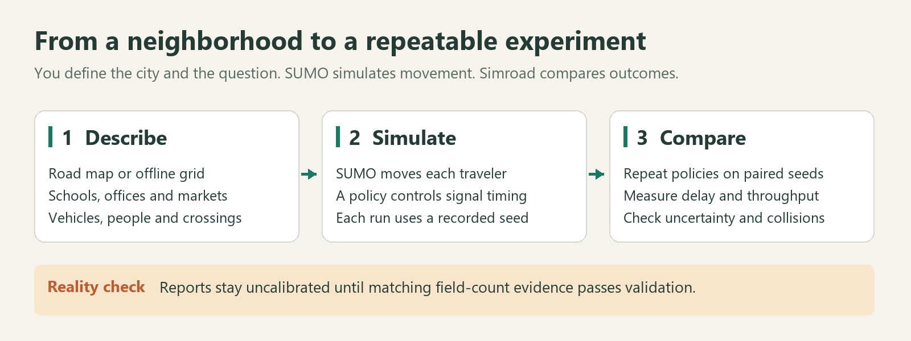
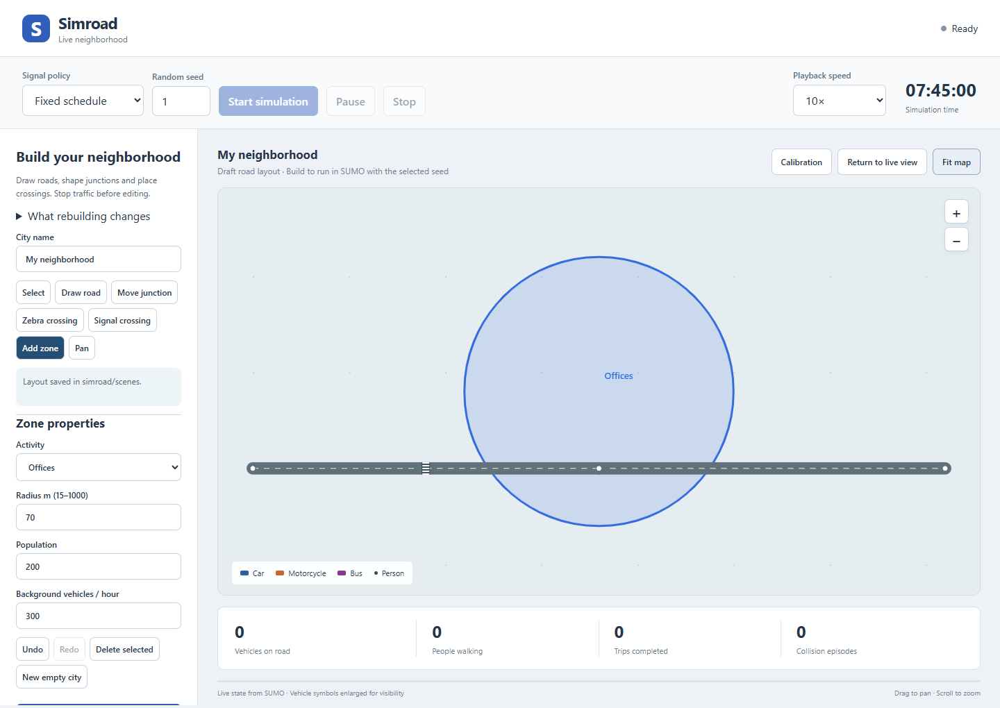
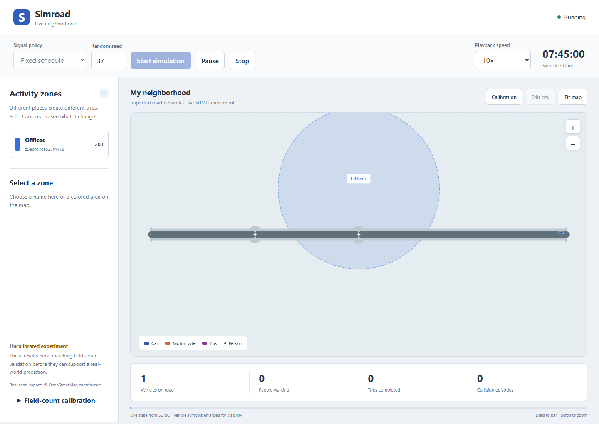
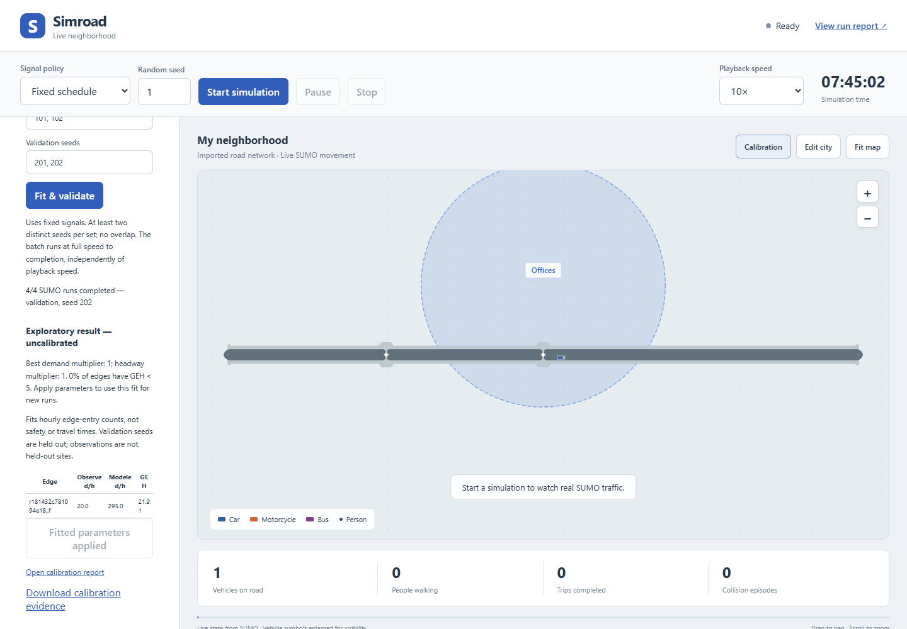
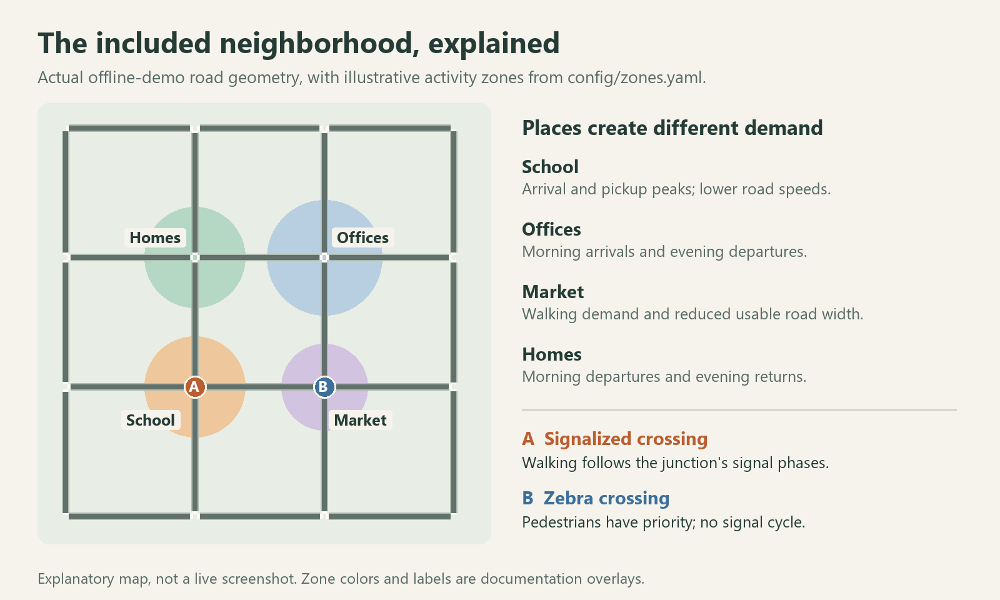
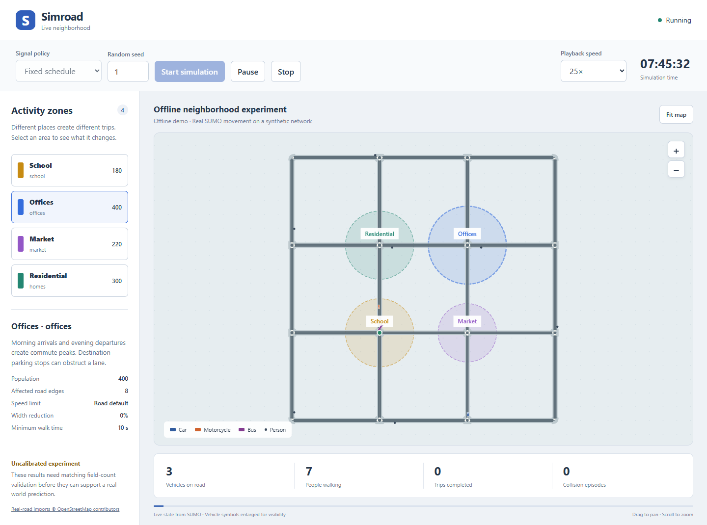

# Simroad

**Explore how roads, people, vehicles, and traffic signals interact in a neighborhood.**

## What is Simroad? — the brief version

Simroad is a Python toolkit for running urban traffic experiments on your computer.
You choose a road network, describe places such as schools and offices, set the
vehicle mix, and run a simulation. It uses **Eclipse SUMO** to move individual
vehicles and pedestrians, then helps you compare traffic-signal policies using
repeatable experiments and readable reports.

For example: **does a signal that responds to queues and waiting pedestrians
perform differently from a fixed signal schedule during the morning rush?**
Simroad runs both policies with matching demand and random seeds, then reports
throughput, stopped time, collisions, and uncertainty in the difference.



**Current form:** a SUMO research toolkit with a browser road editor, live vehicle
view, seeded runs, browser calibration, automatic launchers, and HTML/JSON reports.
The included examples use illustrative inputs. **Uncalibrated output is not a
validated prediction of real traffic.**

[How it works](#how-it-works--the-detailed-version) ·
[Install and run](#start-here) ·
[Compare policies](#compare-two-policies) ·
[Use real roads](#use-real-roads) ·
[Configuration](#configuration) ·
[Current limitations](#version-01-scope)

## Browser road editor and calibration

**SUMO remains the traffic engine.** Draw roads and crossings in your browser,
then build and run a reproducible simulation. The original Python commands,
configuration files, calibration tools, and policy comparisons remain available.

Start the browser app from inside `simroad`:

```bat
run_live.bat
```

On Linux/macOS or Git Bash:

```bash
bash run_live.sh
```

The launcher prepares the Python environment and opens
[the local browser app](http://127.0.0.1:8765). Keep its terminal open. No Node.js,
React installation, or external web service is required. If the default port is
busy, use `run_live.bat --port 8768` or `bash run_live.sh --port 8768`.

### Draw and simulate a neighborhood

1. Stop any active run, then choose **Edit city**. Start from the current map or
   choose **New empty city**.
2. Choose **Draw road** and click its start and end. Keep clicking to extend the
   road; press Escape to end the chain. Intersecting road segments become shared
   SUMO junctions when built.
3. Use **Move junction** to drag nodes. Use **Select** to edit lane count, speed,
   two-way traffic, junction coordinates and traffic signals. Delete a selected
   road, junction, crossing or zone; Undo and Redo recover draft edits.
4. Choose **Zebra crossing** or **Signal crossing**, then click a road. Midblock
   crossings split the road into connected segments. Use **Add zone** to place
   offices, schools, markets, housing, hospitals or transit areas with distinct
   colors and editable population/radius.
5. Set **Random seed** and **Signal policy**, then choose **Build & simulate**.
   Watch real SUMO vehicles and pedestrians, pause/resume, adjust playback speed,
   and open the run report. Playback speed changes wall-clock pacing, not demand.





Road geometry changes are applied **between runs**. Building creates a fresh SUMO
network and standalone project under `runs/live-*/city-*`; it does not mutate a
running SUMO network. A failed compilation keeps the previous active network.
Saved layouts go in `scenes/`; export/import JSON to share them. Run outputs and
source project files remain separate.

**Editor scope:** this first editor builds straight road sections and circular
zones. Editing an imported map simplifies its geometry and does not retain custom
turn restrictions, transit routes or its original demand definition. Rebuilding
uses the drawn zones and background traffic setting to generate demand. Inspect
these new scenario assumptions before comparing scientific results. The original
SUMO project remains available unchanged. The live viewer can still run an
original imported SUMO network without rebuilding it in the editor.

### Fit counts from the browser

1. Stop the simulation and open **Calibration**. Select an available SUMO edge ID
   and upload/paste a CSV with the exact header `edge,count,begin,end`.
2. Enter total vehicle **edge-entry counts** for the displayed observation window
   (seconds since midnight), using unique edge IDs. For example, a demo-window
   row might be `A0B0,120,27900,29700`; these numbers are illustrative, not a survey.
3. Describe the survey source, date and counting method. Choose **Measured field
   counts** only for actual measurements; the default is **Synthetic / example
   counts**.
4. Choose demand/headway multipliers and at least two distinct fitting seeds plus
   two disjoint validation seeds. Choose **Fit & validate**. The batch runs SUMO
   with fixed signals at full speed and displays completed-run progress.
5. Review observed and modeled hourly counts, per-edge GEH, provenance and the
   report. Choose **Apply fitted parameters** to use the fit for subsequent seeded
   runs; download the calibration JSON to keep the evidence.



Synthetic observations always remain **uncalibrated**, even if their numerical
fit passes. A field-count label requires matching configuration/network/SUMO
version and the existing GEH criteria. Validation seeds are held out; field sites
and dates are not automatically held out. Count fitting does not validate safety,
travel times or all driver behavior. **Rebuilding roads clears the active
calibration evidence**; update edge IDs and recalibrate for the new scenario.

The browser limits a calibration batch to 12 parameter combinations and 2–5
seeds per set. Batches finish before another run or build can start. Larger
experiments and motorcycle-share fitting remain available through the CLI below.

## Who is it for?

Simroad is useful for students learning traffic simulation, researchers prototyping
signal policies, and developers building reproducible transport experiments.
You should be comfortable running Python commands and editing small YAML files.
Transport-engineering decisions also require suitable observations, calibration,
and a review of the model's assumptions.

You can explore questions such as:

- How do school arrival peaks affect nearby queues and crossing demand?
- What changes when the fleet contains more motorcycles and fewer cars?
- How do a lower speed limit or reduced usable lane width affect a scenario?
- How do fixed and queue-responsive signal policies compare across repeated runs?
- What happens when a scheduled bus stop blocks a lane versus using an off-road bay approximation?

The built-in comparison command handles **signal policies within one configured
scenario**. Changes to fleet, road geometry, or zone settings need separately
configured experiments; one run per configuration is not enough for a conclusion.

## How it works — the detailed version

### 1. Choose the roads

Start with the included offline grid, import a small real region from
OpenStreetMap, or supply an existing SUMO network. The map provides the road
geometry and junction layout. Simroad uses SUMO's network tools to build the
simulation network and apply configured changes.

The engine is configurable: changing the city should mean changing input files,
not rewriting the traffic-simulation code. A real map alone does not supply
measured traffic demand or establish that the resulting model is realistic.

### 2. Describe why people travel

A **zone** is an area associated with an activity, such as a school, office,
market, residential neighborhood, hospital, or transit corridor. You define its
location, population, and optional behavior overrides.

Simroad derives time-varying trips from these inputs. School demand has arrival
and pickup peaks. Office demand has morning arrivals and evening departures.
Residential demand runs in the opposite commute direction. The timing and volume
are editable in YAML rather than fixed to one city.



*This explanatory image uses the actual offline-demo road geometry. The colors
and labels are documentation overlays, not a live-view screenshot. Zone locations
and populations are illustrative.*

Zones can also affect the roads: a school can lower the speed limit; a market can
reduce usable lane width. The current parking behavior approximates an in-lane
obstruction near a destination. It does not simulate a driver searching for a
parking space around the neighborhood.

### 3. Define vehicles and pedestrian infrastructure

A **fleet profile** describes more than the proportion of cars, motorcycles, and
buses. It also sets vehicle sizes, acceleration, following gaps, speed variation,
and lateral behavior. SUMO's sublane model allows lateral positioning within
lanes, which is important when studying motorcycle filtering.

Pedestrians use SUMO walking routes and crossings. A signalized crossing follows
traffic-light phases; a zebra crossing gives pedestrians priority without a
signal cycle. Scheduled transit services can have explicit routes, stops, and
variable dwell times. Configuration selects whether a stop blocks the lane or
uses the current off-road bay approximation.

### 4. Run the experiment

**SUMO handles movement and interactions. Simroad organizes the experiment.**
Through SUMO's Python interface, TraCI, Simroad starts the simulation, applies the
chosen signal policy, and collects measurements at each step.

A **random seed** is a number that makes the random parts of a run repeatable.
For a policy comparison, Simroad gives both policies the same generated demand
for each seed. It repeats this over several seeds so a fortunate or unfortunate
single run does not become the entire result.

### 5. Read the results and check their limits

Every run creates a browser-readable HTML report, a JSON result, and underlying
SUMO logs and XML outputs. A policy comparison adds confidence intervals and
significance flags for the differences between policies.

| Report item | What it tells you |
| --- | --- |
| Throughput | How many vehicles finish their trips within the simulation window, expressed per hour. |
| Stopped vehicle time | Total time vehicles spend stopped during the window; useful for comparing queueing. |
| Unfinished / not-inserted vehicles | Trips still on the road or unable to enter before the window ends. These help reveal congestion that completed-trip averages can miss. |
| Collision episodes | Distinct collision episodes detected by SUMO; a model-health signal that needs investigation. |
| Paired 95% confidence interval | Uncertainty in the average candidate-minus-baseline difference across matching seeds. An interval spanning zero does not establish a difference at that level. |
| Calibration status | Whether matching field-count evidence has passed this toolkit's validation checks. |

**Calibration** means adjusting uncertain model inputs against observed traffic
counts. Simroad can fit demand, following-headway scaling, and motorcycle share,
then evaluate the count fit with GEH, a traffic-model goodness-of-fit statistic.
A passed count fit does not automatically validate pedestrian behavior, safety,
or a different time period. See [Calibration](#calibration) for the workflow and
[model assumptions](docs/model-assumptions.md) for the practical limits.

## Live web viewer

**Windows: double-click [`run_live.bat`](run_live.bat).** The launcher prepares the
Python environment, builds the network, starts the local server, and opens your
browser. Click **Start simulation** to begin watching traffic.

```powershell
.\run_live.bat
```

On Linux, macOS, or Git Bash:

```bash
bash run_live.sh
```



*Actual local viewer screenshot from the offline example. Vehicle symbols are
enlarged for visibility. The example uses synthetic roads and illustrative demand.*

The viewer runs at **http://127.0.0.1:8765** by default. Keep the launcher terminal
open while using it; press **Ctrl+C** in that terminal to shut down the server.
It listens on your computer only. No cloud service, account, or external map tiles
are needed for the offline example.

- **Watch real movement:** vehicle and pedestrian positions come from the running
  SUMO process. Roads and crossing geometry come from the built network.
- **Identify areas:** offices are blue, schools amber, markets violet, homes teal,
  hospitals rose, and transit zones blue-green. Names accompany colors. Only zones
  present in your configuration appear; the default example includes four types.
- **Inspect a zone:** select its name to view population, affected edges, speed
  limits, width reduction, and the configured minimum crossing time. The existing
  hospital service floor can apply more conservatively across the full network.
- **Control a run:** choose a signal policy and random seed, start, pause, resume,
  change target playback speed, or stop. Use **Start new run** to repeat an experiment.
- **Explore the map:** drag to pan, scroll or use +/− to zoom, and use **Fit map**
  to restore the full network. The zone list provides keyboard-accessible selection.
- **See results:** counters show vehicles, walkers, completed vehicle trips, and
  collision episodes. After completion or Stop, **View run report** opens the report.
  Stopped runs are explicitly marked interrupted and use their actual elapsed time.

A single live run remains an uncalibrated visualization, not a paired policy
comparison or field validation. Signal dots summarize a junction; they do not
show individual turning-movement signals. Playback speed is a target and depends
on available CPU. See [viewer details](docs/live-view.md).

## Automatic launchers

[`run_simroad.bat`](run_simroad.bat) and [`run_simroad.sh`](run_simroad.sh)
prepare the Python environment, build the SUMO network, start the local web server,
and **open the browser automatically**. The `run_live` launchers do the same.
Keep the terminal open while using the simulator. Use `--batch` for the original
automated simulation and policy-comparison workflow.

Windows:

```powershell
.\run_simroad.bat
.\run_simroad.bat --batch --quick --no-open
.\run_live.bat --quick --port 8766
```

```bash
bash run_simroad.sh
bash run_simroad.sh --batch --quick --no-open
bash run_live.sh --project examples/osm/project.yaml
```

| Option | Effect |
| --- | --- |
| `--web` | Open the browser simulator automatically (default for all launchers). |
| `--batch` | Run the batch simulation/comparison workflow and open its final report. |
| `--quick` | Use the first 120 simulated seconds; batch comparison uses two seeds. |
| `--port 8766` | Choose a different local live-server port. |
| `--project PATH` | Use another project YAML, relative to the repository. |
| `--fleet PATH` | Use another fleet YAML. |
| `--gui` | Use with `--batch` to open native SUMO for the initial run. |
| `--skip-compare` | Only build and run one batch simulation. |
| `--seeds 1 2 3 4 5` | Choose batch comparison seeds; live seeds are selected in the viewer. |
| `--workers 1` | Limit batch comparison to one SUMO process at a time. |
| `--tests` | Install development dependencies and run tests before building. |
| `--no-open` | Keep the server/report available without opening a browser. |
| `--help` | Show launcher options. |

First-time setup needs internet to download dependencies. Healthy environments
are reused. Broken or incompatible environments are preserved and a separate
`.venv-runner*` environment is created. Every launch uses a fresh
`runs/auto-<timestamp>-<id>/` directory. Quick mode checks execution only; use
longer windows and enough seeds for a study. Field calibration is not automated
because it requires your observed counts and provenance.

If you already have an activated environment, the direct viewer command is:

```powershell
python -m simroad serve
# Or reuse an existing network:
python -m simroad serve --network runs/network/network.net.xml --no-open
```

## Start here

Python 3.11+ is required; **Python 3.12 is the tested, recommended version**.
Run every command from this repository's root. The Python dependency
`eclipse-sumo` includes the SUMO binaries.

**If this checkout already has a working `.venv`, activate it and skip environment
creation.** Creating a virtual environment over an existing one with a different
Python version can leave incompatible compiled packages behind.

For a fresh Windows installation, install Python 3.12 first, then:

```powershell
py -3.12 -m venv .venv
.\.venv\Scripts\Activate.ps1
python -m pip install -e ".[dev]"
simroad validate
simroad build
simroad run --output runs/first-run --seed 1
```

On macOS/Linux, create a fresh environment with `python3.12 -m venv .venv`,
then activate with `source .venv/bin/activate`. If PowerShell activation
is restricted, use `.\.venv\Scripts\python.exe -m simroad` instead of `simroad`.

The default configuration runs a **synthetic neighborhood**, including a school,
offices, a market, homes, a signalized crossing, and a zebra crossing. It works
offline after dependency installation. Open `runs/first-run/report.html` for the
report, or add `--gui` to a new run to watch the native SUMO visualization.

Run output directories must be new: previous experiments are not overwritten.

## Troubleshooting Python environment errors

If `simroad validate` raises
`ModuleNotFoundError: No module named 'pydantic_core._pydantic_core'`, check which
Python is running:

```powershell
.\.venv\Scripts\python.exe --version
Get-ChildItem .venv\Lib\site-packages\pydantic_core\*.pyd
```

For example, a file named `_pydantic_core.cp312-win_amd64.pyd` is built for
Python 3.12. A Python 3.14 interpreter cannot load that file. Running
`pip install -e ".[dev]"` alone may leave the problem unchanged because package
metadata still says the dependencies are installed. NumPy, SciPy, and other
compiled dependencies can have the same mismatch.

For a mixed or damaged environment, create a fresh one using a single Python
version. With Python 3.12 installed, run these commands from the repository root:

```powershell
# Run deactivate only if a virtual environment is currently active.
deactivate
# Keep the old environment as a backup; this name must not already exist.
Rename-Item -LiteralPath .venv -NewName .venv-backup
py -3.12 -m venv .venv
.\.venv\Scripts\Activate.ps1
python -m pip install -e ".[dev]"
python -m simroad validate
```

Use the explicit `.\.venv\Scripts\python.exe -m simroad validate` command if your
shell still resolves `python` or `simroad` to another environment. The environment
and its backup are excluded from Git; source files and simulation results remain
in their existing locations.

## Compare two policies

```powershell
simroad compare --output runs/policies --strategies fixed pressure --seeds 1 2 3 4 5 6 7 8 9 10 --workers 2
```

Open `runs/policies/comparison.html`. Results include paired Student t confidence
intervals and significance flags for throughput, stopped vehicle time, collision
episodes, and unfinished vehicles. Both policies receive byte-identical demand
for each seed. Parallel workers launch independent SUMO processes.

`fixed` retains SUMO's cyclic signal program with pedestrian minimum service.
`pressure` extends a demanded green or releases an empty one, responds to waiting
pedestrians, and preserves yellow/all-red clearance and minimum crossing times.
It is a simple heuristic, not a claim of an optimal signal controller.

```powershell
simroad --fleet config/fleet_profiles/car_dominant.yaml run --output runs/car-fleet --seed 1
```

Fleet swaps change physical and behavioral parameters, including sublane filtering.
A single fleet-swap run is a functional check, not statistical evidence that one
fleet is better. The policy comparison command pairs strategies within one fleet.

## Use real roads

```powershell
simroad --project examples/osm/project.yaml validate
simroad --project examples/osm/project.yaml build --output runs/real-network
simroad --project examples/osm/project.yaml run --network runs/real-network/network.net.xml --output runs/real-run
```

The real-road example uses an illustrative Kathmandu bounding box; **no city name
or coordinates appear in the engine**. Replace `bbox: [west, south, east, north]`
with your region, use `place: Your neighborhood`, or set `osm_file` to a local
extract. Large `.osm.pbf` inputs require the separate `osmium-tool` CLI for
conversion, or can be converted to `.osm.xml` beforehand.

The example zone locations are not surveyed facilities. Edit their polygons or
centers/radii and populations for your study. Real imports retain or guess OSM
sidewalks and crossings; inspect the result in SUMO Netedit before engineering
use. Explicit crossings use actual SUMO node and edge IDs in `infrastructure.yaml`.
Rebuild after changing road, zone speed/width, or crossing configuration.

## Configuration

| File | Purpose |
| --- | --- |
| `config/project.yaml` | Simulation window, time step and file references |
| `config/city.yaml` | Demo, OSM import, or existing SUMO network |
| `config/zones.yaml` | Zone population, geometry and overrides |
| `config/zone_defaults.yaml` | Editable daily demand pulses and behavior priors for six zone types |
| `config/demand.yaml` | Derive demand from zones and/or add explicit gateway flows |
| `config/fleet_profiles/*.yaml` | Physical, following, sublane and junction behavior by class |
| `config/infrastructure.yaml` | Crossings, transit stops and scheduled routes |

Paths inside a project YAML resolve relative to that file, independent of the
current directory. Zone coordinates default to longitude/latitude; offline demo
zones explicitly use meters in SUMO's `xy` coordinate system. Explicit edge IDs
override spatial matching. Numeric units are documented in the schema field names
and [model assumptions](docs/model-assumptions.md).

Unknown fields, invalid fleet shares, invalid geometry, and time steps longer
than the shortest active vehicle headway fail loudly. Export editor-friendly JSON
schemas with `simroad schema --output schemas`.

## Calibration

Prepare a CSV with one unique network edge per observation, covering the exact
simulation window. Counts represent vehicles entering that edge during the window,
including vehicles initially inserted there; field detectors should match that
measurement definition. Times are seconds since midnight.

```csv
edge,count,begin,end
A1B1,120,27900,29700
B2C2,85,27900,29700
```

Those rows are format examples, **not field observations**. To test the workflow
with invented data, explicitly select `--kind synthetic`.

```powershell
simroad calibrate --output runs/calibration --observations observations.csv --kind field --source "Survey date, location, method and provenance" --demand-scales 0.75 1 1.25 --tau-scales 0.9 1 1.1 --fit-seeds 101 102 --validation-seeds 201 202
simroad run --output runs/calibrated-run --calibration runs/calibration/calibration.json
```

Optional `--motorcycle-shares 0.4 0.6 0.8` fits mix as well. `tau_scale` changes
following headway as a capacity proxy; it is not a direct saturation-flow model.
The fit selects the lowest mean GEH from an explicit grid, then checks independent
validation seeds. Counts are converted to hourly rates for GEH. Passing requires
GEH < 5 at >=85% of observations and GEH < 10 everywhere.

The report code verifies evidence, model/network fingerprint, SUMO version,
field-data provenance and validation statistics. Synthetic observations never
remove the warning. Fitted parameters are automatically applied when an artifact
is supplied, including parallel comparisons. Editing the original configuration
invalidates its calibration. Count calibration does not validate safety, emissions,
pedestrian behavior or unobserved time windows.

## Development

```powershell
python -m pytest
python -m ruff check --config pyproject.toml src tests
```

The tested Python 3.12 dependency snapshot is in `requirements-lock.txt`; install it with
`python -m pip install -r requirements-lock.txt` before the editable install when reproducing this environment.

Tests include SUMO integration. For pure Python checks only, use
`python -m pytest -m "not integration"`. CI runs the full suite on Windows and Linux.
Add a strategy as a module under `src/simroad/strategies/` using the `@register`
decorator. [Architecture](docs/architecture.md) describes the extension points.

## Version 0.1 scope

Implemented: OSM import, configurable zone demand, two fleet profiles, sublane
simulation, speed/width zone effects, signal and priority crossings, scheduled
transit with dwell distributions, parking-obstruction approximation, seeded policy
comparison, GEH fitting, reports, native SUMO viewing, and a local live web viewer
with colored zones, real vehicle/pedestrian positions, and playback controls.

Deferred: automatic midblock road splitting with probabilistic jaywalking,
parking-search circulation, emergency dispatch/preemption, nonresident access
controls, and a general OD estimation/calibration framework.
Setting unsupported probabilistic midblock behavior produces an explicit error.
Existing/supplied midblock junctions can have unprioritized informal crossings.

See [model assumptions and limitations](docs/model-assumptions.md) before using
results to evaluate an intervention. OpenStreetMap imports require attribution
to [OpenStreetMap contributors](https://www.openstreetmap.org/copyright).

